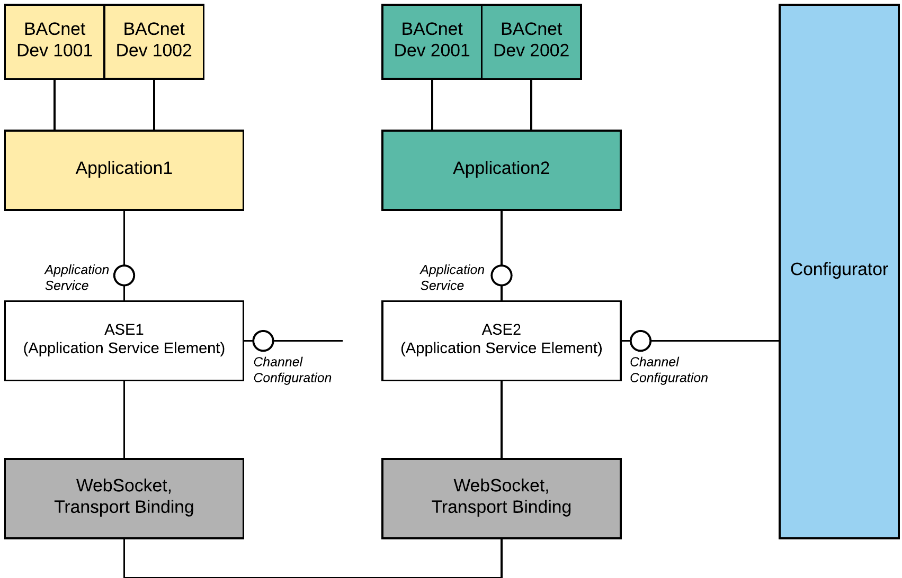
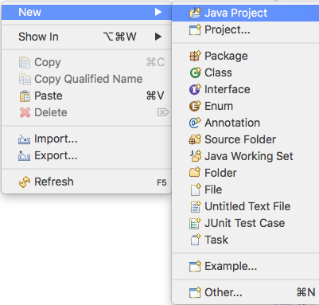
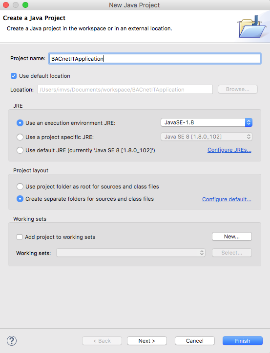
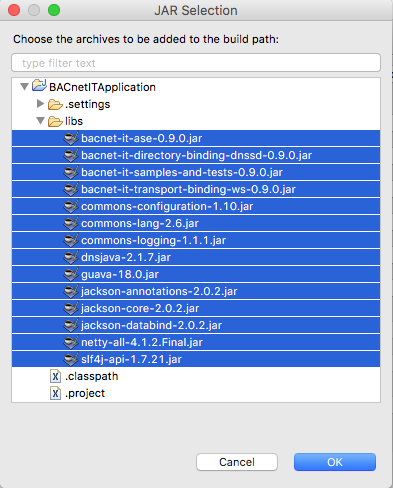

# BACnet/IT Tutorial

__In this tutorial you will learn how to develop applications using our new BACnet/IT stack.__

## Content
[What we do](#what-we-do)  
[- Download Binaries](#download)  
[- Prerequisites](#prerequisites)  
[Create a Demo Applicaton](#create-a-demo-applicaton)  
[- Implement AbstractApplication.java](#implement-abstractapplicationjava)  
[- Implement Application1.java](#implement-application1java)  
[- Implement Application2.java](#implement-application2java)  
[- Implement Configurator.java](#implement-configuratorjava)  
[Complete Code](#complete-code)  
[Build from source](#build-from-source)  
[Required changes for a distributed setup](#required-changes-for-a-distributed-setup)


Create a Demo Applicaton


## What we do

Consider the following figure:  

  


We will create two applications with each two simulated BACnet devices (yellow and green).  
Both applications will extend the abstract class __AbstractApplication__, which is not shown in the figure,  
__AbstractApplication__ provides base functionality to the applications.  
Each application uses an __Application Service Element (ASE)__ to communicate with other applications.  
The __ASE__ component is given but has to be configured. Therefore, we will create the class __Configurator__ (blue).  

The __configurator__ has four fundamental tasks:  

1. Initialize the necessary BACnet/IT ASE components.  
2. Link the two applications with the corresponding communication stacks. (in figure: ASEs, white).  
3. Link the available Transport Bindings (gray) to the ASEs.
4. Enforce communication between devices.

As mentioned in point 4, after the setup of the classes, we let communicate device 1001 (yellow) with device 2001 (green) and vice versa.


Note the two interfaces __ApplicationService__ and __ChannelConfiguration__ and remember the two basic rules:  
1. The Applications's view of ASE is ApplicationService.  
2. The Configurator's view of ASE is ChannelConfiguration.

And the last point before we start:  
All the classes you need to develop any applications, as well as this demo setup, are packed into "api" packages.  
Thus, ensure that all your imported classes that consider components of the BACnet/IT libraries are within an api package.

__With this information in mind, let us start and build our first BACnet/IT application!__


## Download
Download the binary distribution from [here](https://www.cs.technik.fhnw.ch/bacnet-it/releases).  
As an alternative, [build the JARs from source](#build-from-source).


## Prerequisites
- [JAVA JDK 8](http://www.oracle.com/technetwork/java/javase/downloads/index.html) (this tutorial was tested with 1.8.0_102-b14)
- An Integrated Development Environment like [Eclipse](http://www.eclipse.org) or [IntelliJ](https://www.jetbrains.com/idea/)
- The BACnet/IT library binaries


### Eclipse Configuration
+ Create a new __Java Project__ in Eclipse.



+ Name the new project __BACnetITApplication__ and ensure Java 8 is selected as execution JRE.



+ Create a folder __libs__ within the project __BACnetITApplication__


+ Open the project properties


+ Copy all 14 JAR files into the the created __libs__ folder.

+ Click on __Add JARs...__ in the menu __Java Build Path / Libraries__


+ Add all the JAR files (from [Download](#download) ) by selecting them.




## Create a Demo Applicaton

To demonstrate a working setup we create two applications each ontop of their own ASE (communication stack). 
Therefore a __Configurator__ is needed which links the applications to their ASE and initializes some essential parameters.


### Required Classes
For a working setup we create four Java classes in the __BACnetITApplication__ Java project.  
- __AbstractApplication.java__  
- __Application1.java__  
- __Application2.java__  
- __Configurator.java__  

__Go to [Complete Code](#complete-code) to skip the implementation details.__  
  
The next section describes the structure of the four classes in detail.

### __Implement AbstractApplication.java__ 
__AbstractApplication__ is an abstract class that provides base functionality for applications.
Our two applications will extend __AbstractApplication__.

So, the first step is to create an abstract Java class __AbstractApplication__.

Make sure to import the following classes.  
 __Note that by convention just classes within an api package should be used!__

```java
// Make sure to import the following classes
// Import Java components
import java.net.URI;
import java.net.URISyntaxException;
import java.util.LinkedList;
import java.util.List;

// Import packages from the BACnet/IT opensource projects
// By convention just classes within an api package should be used
import ch.fhnw.bacnetit.ase.application.transaction.api.ApplicationService;
import ch.fhnw.bacnetit.ase.application.transaction.api.ChannelListener;
import ch.fhnw.bacnetit.ase.encoding.api.BACnetEID;
import ch.fhnw.bacnetit.ase.encoding.api.TPDU;
import ch.fhnw.bacnetit.ase.encoding.api.T_UnitDataRequest;
import ch.fhnw.bacnetit.samplesandtests.api.deviceobjects.BACnetObjectIdentifier;
import ch.fhnw.bacnetit.samplesandtests.api.deviceobjects.BACnetObjectType;
import ch.fhnw.bacnetit.samplesandtests.api.deviceobjects.BACnetPropertyIdentifier;
import ch.fhnw.bacnetit.samplesandtests.api.encoding.asdu.ASDU;
import ch.fhnw.bacnetit.samplesandtests.api.encoding.asdu.IncomingRequestParser;
import ch.fhnw.bacnetit.samplesandtests.api.encoding.type.constructed.ServicesSupported;
import ch.fhnw.bacnetit.samplesandtests.api.encoding.util.ByteQueue;
import ch.fhnw.bacnetit.samplesandtests.api.service.confirmed.ReadPropertyRequest;
```

The following code shows the class structure, the essential instance variables and the constructor of class __AbstractApplication__.  
Note the following:  
- __ApplicationService__ is the application's view to the __ASE__ and will be passed from the __Configurator__ class.  
- Each application maintains a list with simulated BACnet devices.


```java

public abstract class AbstractApplication {
    
    // applicationService is the application's view of the stack.
    // applicationService is used to send BACnet messages to other devices.
    // The configurator class will pass the applicationService, as shown later
    final private ApplicationService applicationService;
    
    // devices is a list of simulated BACnet devices.
    final public List<ChannelListener> devices = new LinkedList<ChannelListener>();
    
    
    public AbstractApplication(ApplicationService applicationService) {
        this.applicationService = applicationService;
    }
	//...
}
```

Let us implement a simple method to send ReadPropertyRequests to other devices.
BACnet4J is used to build BACnet services (e.g. ReadPropertyRequest).  
Add the following method to class __AbstractApplication__.


```java    
    /**
     * sendReadPropertyRequestUsingBACnet4j() sends a ReadRequestProperty to a
     * given destination. To represent such a ReadPropertyRequest BACnet4J is
     * used. Note that the TPDU constructor demands a byte array that represents
     * the BACnet service. Feel free to provide the byte array without the usage
     * of BACnet4J by using the sendBACnetMessage(byte[]) method.
     * 
     * @throws URISyntaxException
     */
    public void sendReadPropertyRequestUsingBACnet4j(URI destination, BACnetEID from, BACnetEID to)
            throws URISyntaxException {
        final ReadPropertyRequest readRequest = new ReadPropertyRequest(
                new BACnetObjectIdentifier(BACnetObjectType.analogValue, 1),
                BACnetPropertyIdentifier.presentValue);
        final ByteQueue byteQueue = new ByteQueue();
        readRequest.write(byteQueue);
        final TPDU tpdu = new TPDU(from, to,
                byteQueue.popAll());

        final T_UnitDataRequest unitDataRequest = new T_UnitDataRequest(destination, tpdu, 1, true, null);

        applicationService.doRequest(unitDataRequest);

    }
```


There is no need to use BACnet4J to build BACnet services.  Feel free to provide any BACnet services as byte arrays.  
Later in the example we'll send WhoIs- and IAmRequest services between devices, both services are given as valid byte arrays. Add the following method to class __AbstractApplication__.


```java

    /**
     * sendBACnetMessage() sends a BACnet message represented as byte array to the given destination.
     * Ensure the byte array represents a valid BACnet message.
     * @param bacnetMessage
     * @throws URISyntaxException
     */
    public void sendBACnetMessage(URI destination, BACnetEID from, BACnetEID to, byte[] confirmedBacnetMessage) throws URISyntaxException {
      
        final TPDU tpdu = new TPDU(from, to, confirmedBacnetMessage);

        final T_UnitDataRequest unitDataRequest = new T_UnitDataRequest(destination, tpdu, 1, true, null);

        applicationService.doRequest(unitDataRequest);
    }

```


To parse and interpret incoming BACnet messages the following helper method is used. Add the following method to class __AbstractApplication__.


```java    
    
    /**
     * getServiceFromBody() is a helper method to interpret received BACnet
     * messages.
     * 
     * @param body
     * @return
     */
    protected ASDU getServiceFromBody(final byte[] body) {
        final ByteQueue queue = new ByteQueue(body);
        final ServicesSupported servicesSupported = new ServicesSupported();
        servicesSupported.setAll(true);
        final IncomingRequestParser parser = new IncomingRequestParser(
                servicesSupported, queue);
        ASDU request = null;

        try {
            request = parser.parse();
        } catch (final Exception e) {
            System.out.println(e);
        }
        return request;
    }
    
```
Great, you are done with the implementation of class __AbstractApplication__.


### __Implement Application1.java__ 

__Application1__ simulates and maintains two BACnet devices. Each device has to handle incoming BACnet messages. __Application1__ extends __AbstractApplication__.

Create a class for Application1 and extend AbstractApplication.


Make sure to import the following classes.  
 __Note that by convention just classes within an api package should be used!__
 
```java
// Make sure to import the following classes
// Import Java components
import java.net.URI;

// Import packages from the BACnet/IT opensource projects
// By convention just classes within an api package should be used
import ch.fhnw.bacnetit.ase.application.transaction.api.ApplicationService;
import ch.fhnw.bacnetit.ase.application.transaction.api.ChannelListener;
import ch.fhnw.bacnetit.ase.encoding.api.BACnetEID;
import ch.fhnw.bacnetit.ase.encoding.api.T_UnitDataIndication;
import ch.fhnw.bacnetit.samplesandtests.api.encoding.asdu.ASDU;
import ch.fhnw.bacnetit.samplesandtests.api.encoding.asdu.ComplexACK;
import ch.fhnw.bacnetit.samplesandtests.api.encoding.asdu.UnconfirmedRequest;
import ch.fhnw.bacnetit.samplesandtests.api.service.unconfirmed.WhoIsRequest;
```  

Let __Application1__ extends __AbstractApplication__ to inherit base functionality.
__ApplicationService__ will be passed from the __Configurator__. Make sure to invoke __AbstractApplication__'s constructor
and pass the ApplicationService instance to it.
The following code shows the main class structure with the constructor.

```java
/**
 * Simulating a BACnet/IT application using the ApplicationService interface
 * (component of ASE) to send messages to other devices.
 * 
 * @author IMVS, FHNW
 *
 */
public class Application1 extends AbstractApplication {

    /**
     * Constructor of class Application1
     * 
     * @param applicationService,
     *            the applicationService gets passed from the Configurator.
     */
    public Application1(ApplicationService applicationService) {
        super(applicationService);
        // ...
    }
  	// ...
}
``` 


A BACnet device gets simulated by using __ChannelListener__.
The following code shows how __Application1__ implements two BACnet devices (BACnetEID 1001 and 1002).
A BACnet device (an implementation of __ChannelListener__) must handle incoming BACnet messages, you can define the behaviour by adjusting the 
__public void onIndication(T_UnitDataIndication arg0, Object context)__ method.  
__Add the following code into the constructor of Application1, right below of super(applicationService);__

```java
// To simulate a device within the application, a ChannelListener needs
// to get implemented.
ChannelListener bacnetDevice1001 = new ChannelListener(
        new BACnetEID(1001)) {

    /**
     * Handles incoming message errors from the ASE.
     */
    @Override
    public void onError(String arg0) {
        // TODO Auto-generated method stub

    }

    /**
     * Handles incoming messages from the ASE.
     */
    @Override
    public void onIndication(T_UnitDataIndication arg0,
            Object context) {
        System.out.println("Application1 got an indication");
        // Parse the incoming message
        ASDU incoming = getServiceFromBody(arg0.getData().getBody());

        // Dummy Handling of a ReadPropertyAck
        if (incoming instanceof ComplexACK) {
            System.out.println(
                    "Application1 got an indication - ReadPropertyAck");
            System.out.println("************\nReceived Value: "
                    + ((ComplexACK) incoming).getService().toString()
                            .split("\\(")[1].split("\\)")[0]
                    + "\n************");
        }
        // Dummy Handling of a WhoIsRequest
        else if (incoming instanceof UnconfirmedRequest
                && ((UnconfirmedRequest) incoming)
                        .getService() instanceof WhoIsRequest) {
            System.out.println(
                    "Application1 got an indication - WhoIsRequest");

            // Represent an IAmRequest as byte array
            byte[] iAmRequest = new byte[] { (byte) 0x1E, (byte) 0x0E,
                    (byte) 0xC4, (byte) 0x02, (byte) 0x00, (byte) 0x00,
                    (byte) 0x00, (byte) 0x21, (byte) 0x01, (byte) 0x91,
                    (byte) 0x00, (byte) 0x21, (byte) 0x01, (byte) 0x0F,
                    (byte) 0x1F };

            try {
                System.out.println("Application1 sends an IAmRequest to Application2");
                sendBACnetMessage(new URI("ws://localhost:9090"),
                        new BACnetEID(1001), new BACnetEID(2001),iAmRequest);
            } catch (Exception e) {
            }

        }

    }
};

// To simulate a device within the application, a ChannelListener needs
// to get implemented.
ChannelListener bacnetDevice1002 = new ChannelListener(
        new BACnetEID(1002)) {

    /**
     * Handles incoming message errors from the ASE.
     */
    @Override
    public void onError(String arg0) {
        // TODO Auto-generated method stub
    }

    /**
     * Handles incoming messages from the ASE.
     */
    @Override
    public void onIndication(T_UnitDataIndication arg0,
            Object context) {
        // TODO Auto-generated method stub
    }
};
```

Don't forget to add the two BACnet devices to the application's device list.

```java
        // Add the two bacnetDevices to the device list of application1.
        devices.add(bacnetDevice1001);
        devices.add(bacnetDevice1002);
```

Great, you are done with the implementation of class __Application1__.

### __Implement Application2.java__ 

__Application2__ simulates and maintains two BACnet devices as well. Each device has to handle incoming BACnet messages. __Application2__ extends __AbstractApplication__ as well. 


Make sure to import the following classes.  
 __Note that by convention just classes within an api package should be used!__
 
```java
// Make sure to import the following classes
// Import Java components
import java.net.URI;
import java.net.URISyntaxException;

// Import packages from the BACnet/IT opensource projects
// By convention just classes within an api package should be used
import ch.fhnw.bacnetit.ase.application.transaction.api.ApplicationService;
import ch.fhnw.bacnetit.ase.application.transaction.api.ChannelListener;
import ch.fhnw.bacnetit.ase.encoding.api.BACnetEID;
import ch.fhnw.bacnetit.ase.encoding.api.T_UnitDataIndication;
import ch.fhnw.bacnetit.samplesandtests.api.deviceobjects.BACnetObjectIdentifier;
import ch.fhnw.bacnetit.samplesandtests.api.deviceobjects.BACnetObjectType;
import ch.fhnw.bacnetit.samplesandtests.api.deviceobjects.BACnetPropertyIdentifier;
import ch.fhnw.bacnetit.samplesandtests.api.encoding.asdu.ASDU;
import ch.fhnw.bacnetit.samplesandtests.api.encoding.asdu.ConfirmedRequest;
import ch.fhnw.bacnetit.samplesandtests.api.encoding.asdu.UnconfirmedRequest;
import ch.fhnw.bacnetit.samplesandtests.api.encoding.type.primitive.Real;
import ch.fhnw.bacnetit.samplesandtests.api.encoding.type.primitive.UnsignedInteger;
import ch.fhnw.bacnetit.samplesandtests.api.encoding.util.ByteQueue;
import ch.fhnw.bacnetit.samplesandtests.api.service.acknowledgment.ReadPropertyAck;
import ch.fhnw.bacnetit.samplesandtests.api.service.confirmed.ReadPropertyRequest;
import ch.fhnw.bacnetit.samplesandtests.api.service.unconfirmed.IAmRequest;
```

Let __Application2__ extends __AbstractApplication__ to inherit base functionality.
ApplicationService will be passed from the __Configurator__. Make sure to invoke __AbstractApplication__'s constructor
and pass the ApplicationService instance to it.  
Further we define a arbitrary value, this value will get requested from __Application1__ later in this tutorial.
The following code show the main structure and a part of the constructor.

```java
/**
 * Simulating a BACnet/IT application using the ApplicationService interface
 * (component of ASE) to send messages to other devices.
 * 
 * @author IMVS, FHNW
 *
 */
public class Application2 extends AbstractApplication {

    // A value of Application2. Application1 may request this value using a
    // ReadPropertyRequest.
    final private int value = 1000;

    /**
     * Constructor of class Application2
     * 
     * @param applicationService,
     *            the applicationService gets passed from the Configurator.
     */
    public Application2(ApplicationService applicationService) {
        super(applicationService);
        // ...
    
    }
    // ...
}
```


A BACnet device gets simulated by __ChannelListener__.
The following code shows how __Application2__ implements two BACnet devices (BACnetEID 2001 and 2002).
A BACnet device must handle incoming BACnet messages, you can define the behaviour by adjusting the 
__public void onIndication(T_UnitDataIndication arg0, Object context)__ method.  

__Note that in this tutorial Application1 and Application2 handle incoming messages differently.__  

Add the following code into the constructor of __Application2__ right below of __super(applicationService);__


```java
// To simulate a device within the application, a ChannelListener needs
        // to get implemented.
        ChannelListener bacnetDevice2001 = new ChannelListener(
                new BACnetEID(2001)) {

            /**
             * Handles incoming message errors from the ASE.
             */
            @Override
            public void onError(String arg0) {
                // TODO Auto-generated method stub

            }

            /**
             * Handles incoming messages from the ASE.
             */
            @Override
            public void onIndication(T_UnitDataIndication arg0,
                    Object context) {

                System.out.println("Application2 got an indication");
                // Parse the incoming message
                ASDU incoming = getServiceFromBody(arg0.getData().getBody());

                if (incoming instanceof ConfirmedRequest
                        && ((ConfirmedRequest) incoming)
                                .getServiceRequest() instanceof ReadPropertyRequest) {
                    System.out.println(
                            "Application2 got an indication - ReadPropertyRequest");

                    // Prepare DUMMY answer
                    final ByteQueue byteQueue = new ByteQueue();
                    new ReadPropertyAck(
                            new BACnetObjectIdentifier(
                                    BACnetObjectType.analogValue, 1),
                            BACnetPropertyIdentifier.presentValue,
                            new UnsignedInteger(1), new Real(value))
                                    .write(byteQueue);

                    // Send answer
                    try {
                        System.out.println(
                                "Application2 sends an ReadPropertyAck to Application1");
                        sendBACnetMessage(new URI("ws://localhost:8080"),
                                new BACnetEID(2001), new BACnetEID(1001),
                                byteQueue.popAll());
                    } catch (URISyntaxException e) {
                        // TODO Auto-generated catch block
                        e.printStackTrace();
                    }
                } // Dummy Handling of a ReadPropertyAck
                else if (incoming instanceof UnconfirmedRequest
                        && ((UnconfirmedRequest) incoming)
                                .getService() instanceof IAmRequest) {
                    System.out.println(
                            "Application2 got an indication - IAmRequest ");
                }

            }
        };

        // To simulate a device within the application, a ChannelListener needs
        // to get implemented.
        ChannelListener bacnetDevice2002 = new ChannelListener(
                new BACnetEID(2002)) {

            /**
             * Handles incoming message errors from the ASE.
             */
            @Override
            public void onError(String arg0) {
                // TODO Auto-generated method stub
            }

            /**
             * Handles incoming messages from the ASE.
             */
            @Override
            public void onIndication(T_UnitDataIndication arg0,
                    Object context) {
                // TODO Auto-generated method stub
            }
        };
```

Don't forget to add the two BACnet devices to the application's device list.

```java
         // Add the two bacnetDevices to the device list of application2.
        devices.add(bacnetDevice2001);
        devices.add(bacnetDevice2002);
```
Great, you are done with the implementation of class __Application2__.

### __Implement Configurator.java__ 

The Configurator has the following tasks:  
- Java entry point of the example demo.  
- Initialization of essential BACnet/IT components (e.g. Directory Service).  
- Definition of the available Transport Bindings.  
- Linking between Application1 and ASE1, as well as between Application2 and ASE2.  
- Linking between Transport Bindings and the ASEs.  
- Triggers some communication between simulated BACnet devices.  

Note the following sequence diagram to understand better about the __Configurator__ tasks.  


Create a new JAVA class and name it __Configurator__.

Make sure to import the following classes.  
 __Note that by convention just classes within an api package should be used!__
 
```java
// Make sure to import the following classes
// Import Java components
import java.net.URI;

// Import packages from the BACnet/IT opensource projects
// By convention just classes within an api package should be used
import ch.fhnw.bacnetit.ase.application.api.BACnetEntityListener;
import ch.fhnw.bacnetit.ase.application.configuration.api.DiscoveryConfig;
import ch.fhnw.bacnetit.ase.application.transaction.api.*;
import ch.fhnw.bacnetit.ase.encoding.api.BACnetEID;
import ch.fhnw.bacnetit.ase.network.directory.api.DirectoryService;
import ch.fhnw.bacnetit.ase.network.transport.api.*;
import ch.fhnw.bacnetit.directorybinding.dnssd.api.DNSSD;
import ch.fhnw.bacnetit.transportbinding.ws.incoming.api.*;
import ch.fhnw.bacnetit.transportbinding.ws.outgoing.api.*;
```

The __Configurator__ class contains the main() method only.  
Lets go trough the steps one by one.

In this tutorial two ASEs get simulated, both running on localhost (port 8080 and 9090).  
Both ASEs simulate each two BACnet devices.  
An ASE needs one or several Transport Bindings to communicate (e.g. http or websocket).  


The following code shows the main class structure.

```java
public class Configurator {

    public static void main(String[] args) {
    	// ...
    }
}
```

Add the following codes right into the __main()__ method of class __Configurator__.


Use the ChannelFactory to get access to ASE in a proper way.  
Cast the ChannelInterface to ChannelConfiguration, in this way you ensure a proper and limited view to ASE functionality-

```java

        /*
         *********************** SETUP ASE 1 ***********************
         */
        final Channel channel1 = ChannelFactory.getInstance();
        final ChannelConfiguration channelConfiguration1 = channel1;
```
Control Messages define a kind of discovery mechanism in BACnet/IT. Such control messages don't get handled by the ASE itself, therefore the BACnetEntityListener has to be implemented. Make sure to set the BACnetEntityListener in the ASE.

```java
        // Configure BACnetEntity Listener to handle Control Messages
        final BACnetEntityListener bacNetEntityHandler1 = new BACnetEntityListener() {

            @Override
            public void onRemoteAdded(final BACnetEID eid,
                    final URI remoteUri) {
                DirectoryService.getInstance().register(eid, remoteUri, false,
                        true);
            }

            @Override
            public void onRemoteRemove(final BACnetEID eid) {
                // TODO Auto-generated method stub
            }

            @Override
            public void onLocalRequested(final BACnetEID eid) {
                // TODO Auto-generated method stub
            }

        };

        channelConfiguration1.setEntityListener(bacNetEntityHandler1);
```
As mentioned, ASE needs one or several Transport Bindings to communicate.  In this example WebSocket is used for incoming and outgoing messages. The following code shows how you add the WebSocket binding for incoming and outgoing messages.

```java

        // Configure the transport binding
        final ConnectionFactory connectionFactory1 = new ConnectionFactory();
        connectionFactory1.addConnectionClient("ws",
                new WSConnectionClientFactory());
        int wsServerPort1 = 8080;
        connectionFactory1.addConnectionServer("ws",
                new WSConnectionServerFactory(wsServerPort1));
```

At the end, initialize and start ASE1 by passing the prepared Connection Factory.

```java
channelConfiguration1.initializeAndStart(connectionFactory1);
```

Setup ASE2 in the same sense.  
Note because both ASEs run on localhost we have to choose different ports.

```java
 /*
         *********************** SETUP ASE 2 ***********************
         */
        final Channel channel2 = ChannelFactory.getInstance();
        final ChannelConfiguration channelConfiguration2 = channel2;

        // Configure BACnetEntity Listener to handle Control Messages
        final BACnetEntityListener bacNetEntityHandler2 = new BACnetEntityListener() {

            @Override
            public void onRemoteAdded(final BACnetEID eid,
                    final URI remoteUri) {
                DirectoryService.getInstance().register(eid, remoteUri, false,
                        true);
            }

            @Override
            public void onRemoteRemove(final BACnetEID eid) {
                // TODO Auto-generated method stub
            }

            @Override
            public void onLocalRequested(final BACnetEID eid) {
                // TODO Auto-generated method stub
            }

        };

        channelConfiguration2.setEntityListener(bacNetEntityHandler2);

        // Configure the transport binding
        final ConnectionFactory connectionFactory2 = new ConnectionFactory();
        connectionFactory2.addConnectionClient("ws",
                new WSConnectionClientFactory());
        int wsServerPort2 = 9090;
        connectionFactory2.addConnectionServer("ws",
                new WSConnectionServerFactory(wsServerPort2));
        channelConfiguration2.initializeAndStart(connectionFactory2);
```

We already implemented the two Applications.  Remember both Applications extend AbstractApplication and handle incoming messages differently. In the following code the two applications get initialized. Remember further that both applications maintain their simulated BACnet devices in lists. We use these lists to iterate over all simulated BACnet devices of both applications and register the devices into the corresponding ASE.

```java
          /*
         *********************** Register BACnet devices from application 1 in ASE 1 ***********************
         */
        AbstractApplication application1 = new Application1(channel1);
        for (ChannelListener device : application1.devices) {
            channelConfiguration1.registerChannelListener(device);
        }

        /*
         *********************** Register BACnet devices from application 2 in ASE 2 ***********************
         */
        AbstractApplication application2 = new Application2(channel2);
        for (ChannelListener device : application2.devices) {
            channelConfiguration2.registerChannelListener(device);
        }

```

In this example we don't need a directory service because we provide the two destination URIs directly (ws://localhost:8080 and ws://localhost:9090).  Nevertheless, the following example shows how to choose a Directory Binding and initializes the DirectoryService.

```java
        /*
         *********************** Initialize the Directory Service (not used in this example)
         */
        final DiscoveryConfig ds = new DiscoveryConfig("DNSSD", "1.1.1.1",
                "itb.bacnet.ch.", "bds._sub._bacnet._tcp.",
                "dev._sub._bacnet._tcp.", "obj._sub._bacnet._tcp.", false);

        try {
            DirectoryService.init();
            DirectoryService.getInstance().setDNSBinding(new DNSSD(ds));
    
        } catch (final Exception e1) {
            // TODO Auto-generated catch block
            e1.printStackTrace();
        }
```

__Well done, all needed configuration and linking of components is done!__ 
Now let the devices communicate between each other.

In the first communication attempt BACnet device 1001 from application1 sends a ReadPropertyRequest to BACnet device 2001 from application2. Device 2001 confirms the message with a ReadPropertyAck containing "the value" of application2. To get the correct representation of a ReadPropertyRequest and a ReadPropertyAck, BACnet4J is used.

```java
 /*
         *********************** Enforce Application1 to send a ReadPropertyRequest to Application2.
         * Application2 answers with its "value". To represent the
         * ReadPropertyRequest and the ReadPropertyAck BACnet4J is
         * used.***********************
         */
        try {
            System.out.println("Applicatio1 sends a ReadPropRequest to Application2");
            application1.sendReadPropertyRequestUsingBACnet4j(
                    new URI("ws://localhost:"+wsServerPort2), new BACnetEID(1001),
                    new BACnetEID(2001));
        } catch (Exception e) {
            System.err.print(e);
        }

        try {
            Thread.sleep(2000);
        } catch (InterruptedException e1) {
            // TODO Auto-generated catch block
            e1.printStackTrace();
        }
```

In the second communication attempt we renounce of BACnet4J. We let device 2001 from application2 send a WhoIsRequest to device 1001 from application1. Device 1001 answers with an IAmRequest. We provide a valid representation for both messages (WhoIsRequest and IAmRequest) as a given byte array. This example shows the independece of the new BACnet/IT stack with existing BACnet applications.

```java
/*
         *********************** Enforce Application2 to send a WhoIsRequest to Application1.
         * Application1 answers with an IAmRequest. To represent both BACnet
         * services (WhoIsRequest and IAmRequest)  a byte stream is provided.
         * Therefore BACnet4J is not needed.
         *
         */
        
        // Represent a WhoIsRequest as byte array
        byte[] whoIsRequest = new byte[]{(byte)0x1e,(byte)0x8e,(byte)0x8f,(byte)0x1f};
        try{
            System.out.println("Applicatio2 sends a WhoIsRequest to Application1");
            application2.sendBACnetMessage(new URI("ws://localhost:"+wsServerPort1), new BACnetEID(2001), new BACnetEID(1001), 
                    whoIsRequest);
        }catch(Exception e){
            System.out.println(e);
        }
        
        
        // Wait until close
        try{
            System.in.read();
        }catch(Exception e){}

```

Run the __Configurator__, the expected console output should look like:

```shell
Applicatio1 sends a ReadPropRequest to Application2
Application2 got an indication
Application2 got an indication - ReadPropertyRequest
Application2 sends an ReadPropertyAck to Application1
Application1 got an indication
Application1 got an indication - ReadPropertyAck
************
Received Value: 1000.0
************
Applicatio2 sends a WhoIsRequest to Application1
Application1 got an indication
Application1 got an indication - WhoIsRequest
Application1 sends an IAmRequest to Application2
Application2 got an indication
Application2 got an indication - IAmRequest 
```

__Congratulations, your first two BACnet/IT applications are communicating!__ 

<hr>
<hr>

## Complete Code

The following section provides the four classes ready to use.  

### __Complete Code of AbstractApplication.java__

```java
// Make sure to import the following classes
// Import Java components
import java.net.URI;
import java.net.URISyntaxException;
import java.util.LinkedList;
import java.util.List;

// Import packages from the BACnet/IT opensource projects
// By convention just classes within an api package should be used
import ch.fhnw.bacnetit.ase.application.transaction.api.ApplicationService;
import ch.fhnw.bacnetit.ase.application.transaction.api.ChannelListener;
import ch.fhnw.bacnetit.ase.encoding.api.BACnetEID;
import ch.fhnw.bacnetit.ase.encoding.api.TPDU;
import ch.fhnw.bacnetit.ase.encoding.api.T_UnitDataRequest;
import ch.fhnw.bacnetit.samplesandtests.api.deviceobjects.BACnetObjectIdentifier;
import ch.fhnw.bacnetit.samplesandtests.api.deviceobjects.BACnetObjectType;
import ch.fhnw.bacnetit.samplesandtests.api.deviceobjects.BACnetPropertyIdentifier;
import ch.fhnw.bacnetit.samplesandtests.api.encoding.asdu.ASDU;
import ch.fhnw.bacnetit.samplesandtests.api.encoding.asdu.IncomingRequestParser;
import ch.fhnw.bacnetit.samplesandtests.api.encoding.type.constructed.ServicesSupported;
import ch.fhnw.bacnetit.samplesandtests.api.encoding.util.ByteQueue;
import ch.fhnw.bacnetit.samplesandtests.api.service.confirmed.ReadPropertyRequest;

/**
 * AbstractApplication provides base functionality
 * @author IMVS, FHNW
 *
 */
public abstract class AbstractApplication {
    
    // applicationService is the application's view of the stack.
    // applicationService is used to send BACnet messages to other devices.
    // The configurator class will pass the applicationService, as shown later
    final private ApplicationService applicationService;
    
    // devices is a list of simulated BACnet devices.
    final public List<ChannelListener> devices = new LinkedList<ChannelListener>();
    
    
    public AbstractApplication(ApplicationService applicationService) {
        this.applicationService = applicationService;
    }
    
    /**
     * sendReadPropertyRequestUsingBACnet4j() sends a ReadRequestProperty to a
     * given destination. To represent such a ReadPropertyRequest BACnet4J is
     * used. Note that the TPDU constructor demands a byte array that represents
     * the BACnet service. Feel free to provide the byte array without the usage
     * of BACnet4J by using the sendBACnetMessage(byte[]) method.
     * 
     * @throws URISyntaxException
     */
    public void sendReadPropertyRequestUsingBACnet4j(URI destination, BACnetEID from, BACnetEID to)
            throws URISyntaxException {
        final ReadPropertyRequest readRequest = new ReadPropertyRequest(
                new BACnetObjectIdentifier(BACnetObjectType.analogValue, 1),
                BACnetPropertyIdentifier.presentValue);
        final ByteQueue byteQueue = new ByteQueue();
        readRequest.write(byteQueue);
        final TPDU tpdu = new TPDU(from, to,
                byteQueue.popAll());

        final T_UnitDataRequest unitDataRequest = new T_UnitDataRequest(destination, tpdu, 1, true, null);

        applicationService.doRequest(unitDataRequest);

    }
    
    
    /**
     * sendBACnetMessage() sends a BACnet message represented as byte array to the given destination.
     * Ensure the byte array represents a valid BACnet message.
     * @param bacnetMessage
     * @throws URISyntaxException
     */
    public void sendBACnetMessage(URI destination, BACnetEID from, BACnetEID to, byte[] confirmedBacnetMessage) throws URISyntaxException {
      
        final TPDU tpdu = new TPDU(from, to,
                confirmedBacnetMessage);

        final T_UnitDataRequest unitDataRequest = new T_UnitDataRequest(destination, tpdu, 1, true, null);

        applicationService.doRequest(unitDataRequest);
    }
    
    
    /**
     * getServiceFromBody() is a helper method to interpret received BACnet
     * messages.
     * 
     * @param body
     * @return
     */
    protected ASDU getServiceFromBody(final byte[] body) {
        final ByteQueue queue = new ByteQueue(body);
        final ServicesSupported servicesSupported = new ServicesSupported();
        servicesSupported.setAll(true);
        final IncomingRequestParser parser = new IncomingRequestParser(
                servicesSupported, queue);
        ASDU request = null;

        try {
            request = parser.parse();
        } catch (final Exception e) {
            System.out.println(e);
        }
        return request;
    }

}

```

### __Complete Code of Application1.java__

```java
// Make sure to import the following classes
// Import Java components
import java.net.URI;

// Import packages from the BACnet/IT opensource projects
// By convention just classes within an api package should be used
import ch.fhnw.bacnetit.ase.application.transaction.api.ApplicationService;
import ch.fhnw.bacnetit.ase.application.transaction.api.ChannelListener;
import ch.fhnw.bacnetit.ase.encoding.api.BACnetEID;
import ch.fhnw.bacnetit.ase.encoding.api.T_UnitDataIndication;
import ch.fhnw.bacnetit.samplesandtests.api.encoding.asdu.ASDU;
import ch.fhnw.bacnetit.samplesandtests.api.encoding.asdu.ComplexACK;
import ch.fhnw.bacnetit.samplesandtests.api.encoding.asdu.UnconfirmedRequest;
import ch.fhnw.bacnetit.samplesandtests.api.service.unconfirmed.WhoIsRequest;

/**
 * Simulating a BACnet/IT application using the ApplicationService interface
 * (component of ASE) to send messages to other devices.
 * 
 * @author IMVS, FHNW
 *
 */
public class Application1 extends AbstractApplication {

    /**
     * Constructor of class Application1
     * 
     * @param applicationService,
     *            the applicationService gets passed from the Configurator.
     */
    public Application1(ApplicationService applicationService) {
        super(applicationService);

        // To simulate a device within the application, a ChannelListener needs
        // to get implemented.
        ChannelListener bacnetDevice1001 = new ChannelListener(
                new BACnetEID(1001)) {

            /**
             * Handles incoming message errors from the ASE.
             */
            @Override
            public void onError(String arg0) {
                // TODO Auto-generated method stub

            }

            /**
             * Handles incoming messages from the ASE.
             */
            @Override
            public void onIndication(T_UnitDataIndication arg0,
                    Object context) {
                System.out.println("Application1 got an indication");
                // Parse the incoming message
                ASDU incoming = getServiceFromBody(arg0.getData().getBody());

                // Dummy Handling of a ReadPropertyAck
                if (incoming instanceof ComplexACK) {
                    System.out.println(
                            "Application1 got an indication - ReadPropertyAck");
                    System.out.println("************\nReceived Value: "
                            + ((ComplexACK) incoming).getService().toString()
                                    .split("\\(")[1].split("\\)")[0]
                            + "\n************");
                }
                // Dummy Handling of a WhoIsRequest
                else if (incoming instanceof UnconfirmedRequest
                        && ((UnconfirmedRequest) incoming)
                                .getService() instanceof WhoIsRequest) {
                    System.out.println(
                            "Application1 got an indication - WhoIsRequest");

                    // Represent an IAmRequest as byte array
                    byte[] iAmRequest = new byte[] { (byte) 0x1E, (byte) 0x0E,
                            (byte) 0xC4, (byte) 0x02, (byte) 0x00, (byte) 0x00,
                            (byte) 0x00, (byte) 0x21, (byte) 0x01, (byte) 0x91,
                            (byte) 0x00, (byte) 0x21, (byte) 0x01, (byte) 0x0F,
                            (byte) 0x1F };

                    try {
                        System.out.println("Application1 sends an IAmRequest to Application2");
                        sendBACnetMessage(new URI("ws://localhost:9090"),
                                new BACnetEID(1001), new BACnetEID(2001),iAmRequest);
                    } catch (Exception e) {
                    }

                }

            }
        };

        // To simulate a device within the application, a ChannelListener needs
        // to get implemented.
        ChannelListener bacnetDevice1002 = new ChannelListener(
                new BACnetEID(1002)) {

            /**
             * Handles incoming message errors from the ASE.
             */
            @Override
            public void onError(String arg0) {
                // TODO Auto-generated method stub
            }

            /**
             * Handles incoming messages from the ASE.
             */
            @Override
            public void onIndication(T_UnitDataIndication arg0,
                    Object context) {
                // TODO Auto-generated method stub
            }
        };

        // Add the two bacnetDevices to the device list of application1.
        devices.add(bacnetDevice1001);
        devices.add(bacnetDevice1002);
    }

}


```

### __Complete Code of Application2.java__

```java
// Make sure to import the following classes
// Import Java components
import java.net.URI;
import java.net.URISyntaxException;

// Import packages from the BACnet/IT opensource projects
// By convention just classes within an api package should be used
import ch.fhnw.bacnetit.ase.application.transaction.api.ApplicationService;
import ch.fhnw.bacnetit.ase.application.transaction.api.ChannelListener;
import ch.fhnw.bacnetit.ase.encoding.api.BACnetEID;
import ch.fhnw.bacnetit.ase.encoding.api.T_UnitDataIndication;
import ch.fhnw.bacnetit.samplesandtests.api.deviceobjects.BACnetObjectIdentifier;
import ch.fhnw.bacnetit.samplesandtests.api.deviceobjects.BACnetObjectType;
import ch.fhnw.bacnetit.samplesandtests.api.deviceobjects.BACnetPropertyIdentifier;
import ch.fhnw.bacnetit.samplesandtests.api.encoding.asdu.ASDU;
import ch.fhnw.bacnetit.samplesandtests.api.encoding.asdu.ConfirmedRequest;
import ch.fhnw.bacnetit.samplesandtests.api.encoding.asdu.UnconfirmedRequest;
import ch.fhnw.bacnetit.samplesandtests.api.encoding.type.primitive.Real;
import ch.fhnw.bacnetit.samplesandtests.api.encoding.type.primitive.UnsignedInteger;
import ch.fhnw.bacnetit.samplesandtests.api.encoding.util.ByteQueue;
import ch.fhnw.bacnetit.samplesandtests.api.service.acknowledgment.ReadPropertyAck;
import ch.fhnw.bacnetit.samplesandtests.api.service.confirmed.ReadPropertyRequest;
import ch.fhnw.bacnetit.samplesandtests.api.service.unconfirmed.IAmRequest;

/**
 * Simulating a BACnet/IT application using the ApplicationService interface
 * (component of ASE) to send messages to other devices.
 * 
 * @author IMVS, FHNW
 *
 */
public class Application2 extends AbstractApplication {

    // A value of Application2. Application1 may request this value using a
    // ReadPropertyRequest.
    final private int value = 1000;

    /**
     * Constructor of class Application2
     * 
     * @param applicationService,
     *            the applicationService gets passed from the Configurator.
     */
    public Application2(ApplicationService applicationService) {
        super(applicationService);


        // To simulate a device within the application, a ChannelListener needs to get implemented.
        ChannelListener bacnetDevice2001 = new ChannelListener(new BACnetEID(2001)) {
            
            /**
             * Handles incoming message errors from the ASE.
             */
            @Override
            public void onError(String arg0) {
                // TODO Auto-generated method stub

            }
            
            /**
             * Handles incoming messages from the ASE.
             */
            @Override
            public void onIndication(T_UnitDataIndication arg0,
                    Object context) {
                
                System.out.println("Application2 got an indication");
                // Parse the incoming message
                ASDU incoming = getServiceFromBody(arg0.getData().getBody());
                                  
                
                if (incoming instanceof ConfirmedRequest && ((ConfirmedRequest) incoming)
                        .getServiceRequest() instanceof ReadPropertyRequest) {
                    System.out.println("Application2 got an indication - ReadPropertyRequest");

                    // Prepare DUMMY answer
                    final ByteQueue byteQueue = new ByteQueue();
                    new ReadPropertyAck(
                            new BACnetObjectIdentifier(
                                    BACnetObjectType.analogValue, 1),
                            BACnetPropertyIdentifier.presentValue,
                            new UnsignedInteger(1), new Real(value))
                                    .write(byteQueue);


                    // Send answer
                    try {
                        System.out.println("Application2 sends an ReadPropertyAck to Application1");
                        sendBACnetMessage(new URI("ws://localhost:8080"),new BACnetEID(2001),new BACnetEID(1001),
                                byteQueue.popAll());
                    } catch (URISyntaxException e) {
                        // TODO Auto-generated catch block
                        e.printStackTrace();
                    }
                } // Dummy Handling of a ReadPropertyAck
                else if (incoming instanceof UnconfirmedRequest && ((UnconfirmedRequest)incoming).getService() instanceof IAmRequest) {
                    System.out.println(
                            "Application2 got an indication - IAmRequest ");
                }

            }
        };
        
        // To simulate a device within the application, a ChannelListener needs to get implemented.
        ChannelListener bacnetDevice2002 = new ChannelListener(new BACnetEID(2002)) {
            
            /**
             * Handles incoming message errors from the ASE.
             */
            @Override
            public void onError(String arg0) {
                // TODO Auto-generated method stub
            }

            /**
             * Handles incoming messages from the ASE.
             */
            @Override
            public void onIndication(T_UnitDataIndication arg0,
                    Object context) {
                // TODO Auto-generated method stub
            }
        };
        
        // Add the two bacnetDevices to the device list of application2.
        devices.add(bacnetDevice2001);
        devices.add(bacnetDevice2002);
    }

}


```

### __Complete Code of Configurator.java__

```java
// Make sure to import the following classes
// Import Java components
import java.net.URI;

// Import packages from the BACnet/IT opensource projects
// By convention just classes within an api package should be used
import ch.fhnw.bacnetit.ase.application.api.BACnetEntityListener;
import ch.fhnw.bacnetit.ase.application.configuration.api.DiscoveryConfig;
import ch.fhnw.bacnetit.ase.application.transaction.api.*;
import ch.fhnw.bacnetit.ase.encoding.api.BACnetEID;
import ch.fhnw.bacnetit.ase.network.directory.api.DirectoryService;
import ch.fhnw.bacnetit.ase.network.transport.api.*;
import ch.fhnw.bacnetit.directorybinding.dnssd.api.DNSSD;
import ch.fhnw.bacnetit.transportbinding.ws.incoming.api.*;
import ch.fhnw.bacnetit.transportbinding.ws.outgoing.api.*;

public class Configurator {

    public static void main(String[] args) {

        /*
         *********************** SETUP ASE 1 ***********************
         */
        final Channel channel1 = ChannelFactory.getInstance();
        final ChannelConfiguration channelConfiguration1 = channel1;

        // Configure BACnetEntity Listener to handle Control Messages
        final BACnetEntityListener bacNetEntityHandler1 = new BACnetEntityListener() {

            @Override
            public void onRemoteAdded(final BACnetEID eid,
                    final URI remoteUri) {
                DirectoryService.getInstance().register(eid, remoteUri, false,
                        true);
            }

            @Override
            public void onRemoteRemove(final BACnetEID eid) {
                // TODO Auto-generated method stub
            }

            @Override
            public void onLocalRequested(final BACnetEID eid) {
                // TODO Auto-generated method stub
            }

        };

        channelConfiguration1.setEntityListener(bacNetEntityHandler1);

        // Configure the transport binding
        final ConnectionFactory connectionFactory1 = new ConnectionFactory();
        connectionFactory1.addConnectionClient("ws",
                new WSConnectionClientFactory());
        int wsServerPort1 = 8080;
        connectionFactory1.addConnectionServer("ws",
                new WSConnectionServerFactory(wsServerPort1));
        channelConfiguration1.initializeAndStart(connectionFactory1);

        /*
         *********************** SETUP ASE 2 ***********************
         */
        final Channel channel2 = ChannelFactory.getInstance();
        final ChannelConfiguration channelConfiguration2 = channel2;

        // Configure BACnetEntity Listener to handle Control Messages
        final BACnetEntityListener bacNetEntityHandler2 = new BACnetEntityListener() {

            @Override
            public void onRemoteAdded(final BACnetEID eid,
                    final URI remoteUri) {
                DirectoryService.getInstance().register(eid, remoteUri, false,
                        true);
            }

            @Override
            public void onRemoteRemove(final BACnetEID eid) {
                // TODO Auto-generated method stub
            }

            @Override
            public void onLocalRequested(final BACnetEID eid) {
                // TODO Auto-generated method stub
            }

        };

        channelConfiguration2.setEntityListener(bacNetEntityHandler2);

        // Configure the transport binding
        final ConnectionFactory connectionFactory2 = new ConnectionFactory();
        connectionFactory2.addConnectionClient("ws",
                new WSConnectionClientFactory());
        int wsServerPort2 = 9090;
        connectionFactory2.addConnectionServer("ws",
                new WSConnectionServerFactory(wsServerPort2));
        channelConfiguration2.initializeAndStart(connectionFactory2);

        /*
         *********************** Register BACnet devices from application 1 in ASE 1 ***********************
         */
        AbstractApplication application1 = new Application1(channel1);
        for (ChannelListener device : application1.devices) {
            channelConfiguration1.registerChannelListener(device);
        }

        /*
         *********************** Register BACnet devices from application 2 in ASE 2 ***********************
         */
        AbstractApplication application2 = new Application2(channel2);
        for (ChannelListener device : application2.devices) {
            channelConfiguration2.registerChannelListener(device);
        }

        /*
         *********************** Initialize the directory service (not used in this example)
         */
        final DiscoveryConfig ds = new DiscoveryConfig("DNSSD", "1.1.1.1",
                "itb.bacnet.ch.", "bds._sub._bacnet._tcp.",
                "dev._sub._bacnet._tcp.", "obj._sub._bacnet._tcp.", false);

        try {
            DirectoryService.init();
            DirectoryService.getInstance().setDNSBinding(new DNSSD(ds));

        } catch (final Exception e1) {
            // TODO Auto-generated catch block
            e1.printStackTrace();
        }

        /*
         *********************** Enforce Application1 to send a ReadPropertyRequest to Application2.
         * Application2 answers with its "value". To represent the
         * ReadPropertyRequest and the ReadPropertyAck BACnet4J is
         * used.***********************
         */
        try {
            System.out.println("Applicatio1 sends a ReadPropRequest to Application2");
            application1.sendReadPropertyRequestUsingBACnet4j(
                    new URI("ws://localhost:"+wsServerPort2), new BACnetEID(1001),
                    new BACnetEID(2001));
        } catch (Exception e) {
            System.err.print(e);
        }

        try {
            Thread.sleep(2000);
        } catch (InterruptedException e1) {
            // TODO Auto-generated catch block
            e1.printStackTrace();
        }
        
        
      
        /*
         *********************** Enforce Application2 to send a WhoIsRequest to Application1.
         * Application1 answers with an IAmRequest. To represent both BACnet
         * services (WhoIsRequest and IAmRequest)  a byte stream is provided.
         * Therefore BACnet4J is not needed.
         *
         */
        
        // Represent a WhoIsRequest as byte array
        byte[] whoIsRequest = new byte[]{(byte)0x1e,(byte)0x8e,(byte)0x8f,(byte)0x1f};
        try{
            System.out.println("Applicatio2 sends a WhoIsRequest to Application1");
            application2.sendBACnetMessage(new URI("ws://localhost:"+wsServerPort1), new BACnetEID(2001), new BACnetEID(1001), 
                    whoIsRequest);
        }catch(Exception e){
            System.out.println(e);
        }
        
        
        // Wait until close
        try{
            System.in.read();
        }catch(Exception e){}
        

       
    }
}

```

<hr>
<hr>

# Build from source

Instead of downloading the binaries you can build the JAR files from source.  
We are working with [Gradle Build Tool](https://gradle.org).  
For simplicity we provide Gradle Wrappers, therefore you don't have to install Gradle Build Tool.  
Ensure your JDK is set and follow the steps to build the projects.


## Get the source

1. Create a new empty directory __BACnetIT__ and make it the current directory.
2. Clone the following GitHub projects:  
__ase__ project:  
```https://github.com/fhnw-bacnet-it/ase.git```  
__transport-binding-ws__ project:  
```https://github.com/fhnw-bacnet-it/transport-binding-ws.git```  
__directory-binding-dnssd__ project:  
```https://github.com/fhnw-bacnet-it/directory-binding-dnssd.git```  
__samples-and-tests__ project:  
```https://github.com/fhnw-bacnet-it/samples-and-tests.git```


Alternatively use the following commands to checkout all the projects.  
__MAC OSX or LINUX:__

```shell
mkdir -p ~/BACnetIT/
cd ~/BACnetIT/
git clone https://github.com/fhnw-bacnet-it/ase.git
git clone https://github.com/fhnw-bacnet-it/transport-binding-ws.git
git clone https://github.com/fhnw-BACnet-IT/directory-binding-dnssd.git
git clone https://github.com/fhnw-BACnet-IT/samples-and-tests.git
```
__WINDOWS:__

```shell
mkdir %HOMEPATH%\BACnetIT\
cd %HOMEPATH%\BACnetIT\
git clone https://github.com/fhnw-bacnet-it/ase.git
git clone https://github.com/fhnw-bacnet-it/transport-binding-ws.git
git clone https://github.com/fhnw-BACnet-IT/directory-binding-dnssd.git
git clone https://github.com/fhnw-BACnet-IT/samples-and-tests.git
```


## Build the Source using Gradle Wrapper

1. Make __BACnetIT/samples-and-tests__ the current directory.
2. Note that project __samples-and-tests__ depends on the projects __ase__, __transport-binding-ws__ and __directory-binding-dnssd__, thus ensure that all projects are stored at the same level in the __BACnetIT__ folder.
3. Build __samples-and-tests__ using Gradle Wrapper:  

__MAC OSX or LINUX:__

```shell
  cd samples-and-tests
  ./gradlew clean build -x test
```

__WINDOWS:__


```shell
  cd samples-and-tests
  gradlew.bat clean build -x test
```

4. Find all needed dependencies as JAR files in a ZIP archive under __samples-and-tests/build/distributions__.

<hr>
<hr>

# Required changes for a distributed Setup
To run this example in a distributed setup. (E.g. if you are using two computers and want them to communicate) note the following:

- __Changes in Configurator__:  
Adjust the destination ip address and port. Replace __localhost__ and __wsServerPort2__ with the corresponding information.  
Further check, that your device has EID 2001 and your communication partners device has EID 1001, otherwise adjust the EID in the code.


```java
// Represent a WhoIsRequest as byte array
byte[] whoIsRequest = new byte[]{(byte)0x1e,(byte)0x8e,(byte)0x8f,(byte)0x1f};
try{
    System.out.println("Applicatio2 sends a WhoIsRequest to Application1");
    application2.sendBACnetMessage(new URI("ws://[localhost]:"+[wsServerPort1]),
	     new BACnetEID([2001]), 
	     new BACnetEID([1001]),
	     whoIsRequest);
}catch(Exception e){
    System.out.println(e);
}
```

- __Changes in Application__:  
An application handles and answers to incoming messages. Therefore, change the URI to which the response shoud go.  
Replace __localhost__ and __port__ as well. Further check, that your device has EID 1001 and your communication partners device has EID 2001, otherwise adjust the EID in the code.

```java
// Dummy Handling of a WhoIsRequest
else if (incoming instanceof UnconfirmedRequest 
	&& ((UnconfirmedRequest) incoming).getService() instanceof WhoIsRequest) {
    System.out.println("Application1 got an indication - WhoIsRequest");

    // Represent an IAmRequest as byte array
    byte[] iAmRequest = new byte[] { (byte) 0x1E, (byte) 0x0E,
            (byte) 0xC4, (byte) 0x02, (byte) 0x00, (byte) 0x00,
            (byte) 0x00, (byte) 0x21, (byte) 0x01, (byte) 0x91,
            (byte) 0x00, (byte) 0x21, (byte) 0x01, (byte) 0x0F,
            (byte) 0x1F };

    try {
        System.out.println("Application1 sends an IAmRequest to Application2");
        sendBACnetMessage(new URI("ws://[localhost]:[9090]"),
                new BACnetEID([1001]), new BACnetEID([2001]),iAmRequest);
    } catch (Exception e) {
    }

}
```
