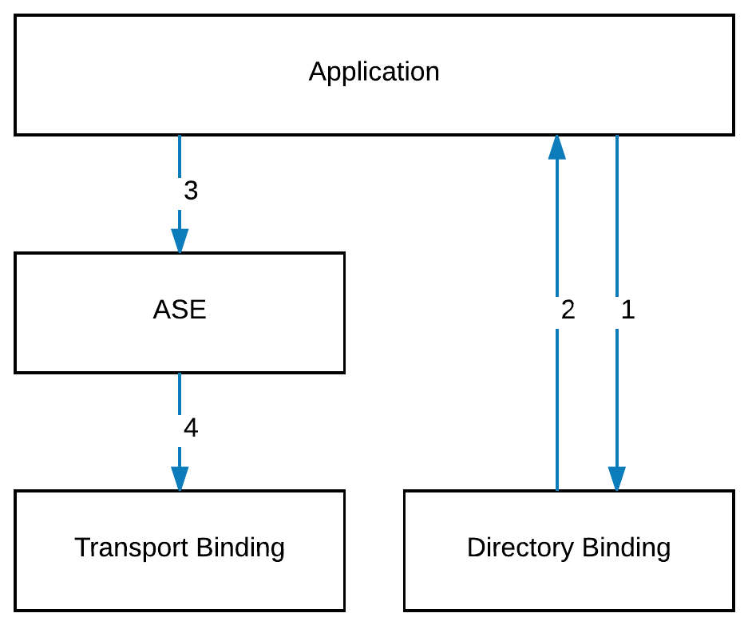

# BACnet/IT Tutorial

In this tutorial you will learn how to develop applications using the new BACnet/IT stack.

## What we do
folgt.


## Prerequisites and BACnet/IT open-source binaries
- Latest [JAVA JDK 8](http://www.oracle.com/technetwork/java/javase/downloads/index.html) (this tutorial got tested with 1.8.0_102-b14)
- An Integrated Development Environment like [Eclipse](http://www.eclipse.org) or [IntelliJ](https://www.jetbrains.com/idea/)
- The BACnet/IT open-source binaries

For the following Tutorial Eclipse is used.

## Eclipse Configurations
1. Create a new Java Project in Eclipse.


2. Name the new Project __BACnetITApplication__ and ensure Java 8 is choosen as executation JRE.


3. Create a folder __libs__ within the project __BACnetITApplication__


4. Open the project properties


5. Click on __Add JARs...__ in the menu __Java Build Path/Libraries__


6. Add all the jar files by selecting.


## Create an application

To demonstrate a working setup we create two applications each ontop of its own stack. Further a Configurator is needed. Therefore create three classes: __Configurator.java__, __Application1.java__ and __Application2.java__.


### Applications
1. Ensure you created two classes in the default package __Application1.java__ and __Application2.java__

2. Lets start implementing __Application1.java__

Note tha java inline comments for further explanation.

```java
// Ensure to import the following classes
import java.net.URI;
import java.net.URISyntaxException;
import java.util.LinkedList;
import java.util.List;
import ch.fhnw.bacnetit.ase.application.transaction.api.ApplicationService;
import ch.fhnw.bacnetit.ase.application.transaction.api.ChannelListener;
import ch.fhnw.bacnetit.ase.encoding.api.BACnetEID;
import ch.fhnw.bacnetit.ase.encoding.api.TPDU;
import ch.fhnw.bacnetit.ase.encoding.api.T_UnitDataIndication;
import ch.fhnw.bacnetit.ase.encoding.api.T_UnitDataRequest;
import ch.fhnw.bacnetit.samplesandtests.deviceobjects.BACnetObjectIdentifier;
import ch.fhnw.bacnetit.samplesandtests.deviceobjects.BACnetObjectType;
import ch.fhnw.bacnetit.samplesandtests.deviceobjects.BACnetPropertyIdentifier;
import ch.fhnw.bacnetit.samplesandtests.encoding.asdu.ASDU;
import ch.fhnw.bacnetit.samplesandtests.encoding.asdu.ComplexACK;
import ch.fhnw.bacnetit.samplesandtests.encoding.asdu.IncomingRequestParser;
import ch.fhnw.bacnetit.samplesandtests.encoding.type.constructed.ServicesSupported;
import ch.fhnw.bacnetit.samplesandtests.encoding.util.ByteQueue;
import ch.fhnw.bacnetit.samplesandtests.service.confirmed.ReadPropertyRequest;

/**
 * Simulating a BACnet/IT application
 * @author IMVS, FHNW
 *
 */
public class Application1 {

    // applicationService is the applications view of the stack. 
    // applicationService is used to send BACnet messages to other devices.
    // The configurator class will pass the applicationService, as shown later in the T
    final private ApplicationService applicationService;
   
    // devices is a list of simulated bacnet devices. 
    // Application 1 will simulate two devices with the BACnetEIDs 1001 and 1002. 
    final public List<ChannelListener> devices = new LinkedList<ChannelListener>();

    /**
     * Constructor of class Application1
     * @param applicationService, the applicationService gets passed from the Configurator.
     */
    public Application1(ApplicationService applicationService) {
        this.applicationService = applicationService;
        
        // Adding a simulated bacnet device, with bacneteid 1001, to the list of devices in application1.
        // To simulate a bacnet device, an anonymous class extending ChannelListener gets implemented.
        // We have to implement the two abstract methods onIndication and onError
        devices.add(new ChannelListener(new BACnetEID(1001)) {

            @Override
            public void onError(String arg0) {
                // TODO Auto-generated method stub

            }

            /**
             * Application 1 will send a ReadPropertyRequest to Application 2. 
             * Application 2 will response to the request. 
             * Therefore Application 1 has to handle such a response.
             */
            @Override
            public void onIndication(T_UnitDataIndication arg0,
                    Object context) {
                // Dummy Handling of a bacnet message indication
                System.out.println("Application1 got an indication");
                System.out.println("************\nReceived Value: "
                        + ((ComplexACK) getServiceFromBody(
                                arg0.getData().getBody())).getService()
                                        .toString().split("\\(")[1]
                                                .split("\\)")[0]
                        + "\n************");

            }
        });
        
        // Adding a simulated bacnet device, with bacneteid 1002, to the list of devices in application1.
        // To simulate a bacnet device, an anonymous class extending ChannelListener gets implemented.
        // We have to implement the two abstract methods onIndication and onError
        devices.add(new ChannelListener(new BACnetEID(1002)) {

            @Override
            public void onError(String arg0) {
                // TODO Auto-generated method stub

            }

            @Override
            public void onIndication(T_UnitDataIndication arg0,
                    Object context) {
                // TODO Auto-generated method stub

            }

        });
    }

    /**
     * sendReadPropertyRequest() sends a ReadRequestProperty to a given destination.
     * To represent such a ReadPropertyRequest BACnet4J is used.
     * Note that the TPDU constructor demands a byte array that represents the BACnet service.
     * Feel free to provide the byte array without the usage of BACnet4J.
     * @throws URISyntaxException
     */
    public void sendReadPropertyRequest() throws URISyntaxException {
        final ReadPropertyRequest readRequest = new ReadPropertyRequest(
                new BACnetObjectIdentifier(BACnetObjectType.analogValue, 1),
                BACnetPropertyIdentifier.presentValue);
        final ByteQueue byteQueue = new ByteQueue();
        readRequest.write(byteQueue);
        final TPDU tpdu = new TPDU(new BACnetEID(1001), new BACnetEID(2001),
                byteQueue.popAll());

        final T_UnitDataRequest unitDataRequest = new T_UnitDataRequest(
                new URI("ws://localhost:9090"), tpdu, 1, true, null);

        applicationService.doRequest(unitDataRequest);

    }
    
    /**
     * getServiceFromBody() is a helper method to interpret received bacnet messages.
     * @param body
     * @return
     */
    private ASDU getServiceFromBody(final byte[] body) {
        final ByteQueue queue = new ByteQueue(body);
        final ServicesSupported servicesSupported = new ServicesSupported();
        servicesSupported.setAll(true);
        final IncomingRequestParser parser = new IncomingRequestParser(
                servicesSupported, queue);
        ASDU request = null;

        try {
            request = parser.parse();
        } catch (final Exception e) {
            System.out.println(e);
        }
        return request;
    }

}


```
2. Lets start implementing __Application2.java__

```java
import java.net.URI;
import java.net.URISyntaxException;
import java.util.LinkedList;
import java.util.List;

import ch.fhnw.bacnetit.ase.application.transaction.api.ApplicationService;
import ch.fhnw.bacnetit.ase.application.transaction.api.ChannelListener;
import ch.fhnw.bacnetit.ase.encoding.api.BACnetEID;
import ch.fhnw.bacnetit.ase.encoding.api.TPDU;
import ch.fhnw.bacnetit.ase.encoding.api.T_UnitDataIndication;
import ch.fhnw.bacnetit.ase.encoding.api.T_UnitDataRequest;

import ch.fhnw.bacnetit.samplesandtests.deviceobjects.BACnetObjectIdentifier;
import ch.fhnw.bacnetit.samplesandtests.deviceobjects.BACnetObjectType;
import ch.fhnw.bacnetit.samplesandtests.deviceobjects.BACnetPropertyIdentifier;
import ch.fhnw.bacnetit.samplesandtests.encoding.asdu.ASDU;
import ch.fhnw.bacnetit.samplesandtests.encoding.asdu.ConfirmedRequest;
import ch.fhnw.bacnetit.samplesandtests.encoding.asdu.IncomingRequestParser;
import ch.fhnw.bacnetit.samplesandtests.encoding.type.constructed.ServicesSupported;
import ch.fhnw.bacnetit.samplesandtests.encoding.type.primitive.Real;
import ch.fhnw.bacnetit.samplesandtests.encoding.type.primitive.UnsignedInteger;
import ch.fhnw.bacnetit.samplesandtests.encoding.util.ByteQueue;
import ch.fhnw.bacnetit.samplesandtests.service.acknowledgment.ReadPropertyAck;
import ch.fhnw.bacnetit.samplesandtests.service.confirmed.ReadPropertyRequest;
import ch.fhnw.bacnetit.samplesandtests.util.BytesUtil;

public class Application2 {
    final private ApplicationService applicationService;
    final private int value = 2323;

    final public List<ChannelListener> devices = new LinkedList<ChannelListener>();

    public Application2(ApplicationService applicationService) {
        this.applicationService = applicationService;

        devices.add(new ChannelListener(new BACnetEID(2001)) {

            @Override
            public void onError(String arg0) {
                // TODO Auto-generated method stub

            }

            @Override
            public void onIndication(T_UnitDataIndication arg0,
                    Object context) {
                // Dummy Handling of an indication
                System.out.println("Application2 got an indication");
                ASDU msg = getServiceFromBody(arg0.getData().getBody());

                if (msg instanceof ConfirmedRequest && ((ConfirmedRequest) msg)
                        .getServiceRequest() instanceof ReadPropertyRequest) {

                    // Prepare DUMMY answer
                    final ByteQueue byteQueue = new ByteQueue();
                    new ReadPropertyAck(
                            new BACnetObjectIdentifier(
                                    BACnetObjectType.analogValue, 1),
                            BACnetPropertyIdentifier.presentValue,
                            new UnsignedInteger(1), new Real(value))
                                    .write(byteQueue);
                    ;

                    // Send answer
                    System.out.println("send:"
                            + BytesUtil.bytesToHex(byteQueue.peekAll()));
                    final TPDU tpdu = new TPDU(new BACnetEID(2001),
                            new BACnetEID(1001), byteQueue.popAll());

                    T_UnitDataRequest unitDataRequest;
                    try {
                        unitDataRequest = new T_UnitDataRequest(
                                new URI("ws://localhost:8080"), tpdu, 1, false,
                                null);
                        applicationService.doRequest(unitDataRequest);
                    } catch (URISyntaxException e) {
                        // TODO Auto-generated catch block
                        e.printStackTrace();
                    }
                }

            }
        });

        devices.add(new ChannelListener(new BACnetEID(2002)) {

            @Override
            public void onError(String arg0) {
                // TODO Auto-generated method stub

            }

            @Override
            public void onIndication(T_UnitDataIndication arg0,
                    Object context) {
                // TODO Auto-generated method stub
            }
        });
    }

    private ASDU getServiceFromBody(final byte[] body) {
        final ByteQueue queue = new ByteQueue(body);
        final ServicesSupported servicesSupported = new ServicesSupported();
        servicesSupported.setAll(true);
        final IncomingRequestParser parser = new IncomingRequestParser(
                servicesSupported, queue);
        ASDU request = null;

        try {
            request = parser.parse();
        } catch (final Exception e) {
            System.out.println(e);
        }
        return request;
    }

}

```


3. Lets start implementing __Configurator.java__

```java
import java.net.URI;
import ch.fhnw.bacnetit.ase.application.api.BACnetEntityListener;
import ch.fhnw.bacnetit.ase.application.configuration.api.DiscoveryConfig;
import ch.fhnw.bacnetit.ase.application.transaction.api.*;
import ch.fhnw.bacnetit.ase.encoding.api.BACnetEID;
import ch.fhnw.bacnetit.ase.network.directory.api.DirectoryService;
import ch.fhnw.bacnetit.ase.network.transport.api.*;
import ch.fhnw.bacnetit.directorybinding.dnssd.api.DNSSD;
import ch.fhnw.bacnetit.transportbinding.ws.incoming.api.*;
import ch.fhnw.bacnetit.transportbinding.ws.outgoing.api.*;

public class Configurator {

    public static void main(String[] args) {

        /*
         *********************** SETUP STACK 1 ***********************
         */
        final Channel channel1 = ChannelFactory.getInstance();
        final ChannelConfiguration channelConfiguration1 = channel1;

        // Configure BACnetEntity Listener to handle Control Messages
        final BACnetEntityListener bacNetEntityHandler1 = new BACnetEntityListener() {

            @Override
            public void onRemoteAdded(final BACnetEID eid,
                    final URI remoteUri) {
                DirectoryService.getInstance().register(eid, remoteUri, false,
                        true);
            }

            @Override
            public void onRemoteRemove(final BACnetEID eid) {
                // TODO Auto-generated method stub
            }

            @Override
            public void onLocalRequested(final BACnetEID eid) {
                // TODO Auto-generated method stub
            }

        };

        channelConfiguration1.setEntityListener(bacNetEntityHandler1);

        // Configure the transport binding
        final ConnectionFactory connectionFactory1 = new ConnectionFactory();
        connectionFactory1.addConnectionClient("ws",
                new WSConnectionClientFactory());
        int wsServerPort1 = 8080;
        connectionFactory1.addConnectionServer("ws",
                new WSConnectionServerFactory(wsServerPort1));
        channelConfiguration1.initializeAndStart(connectionFactory1);

        /*
         *********************** SETUP STACK 2 ***********************
         */
        final Channel channel2 = ChannelFactory.getInstance();
        final ChannelConfiguration channelConfiguration2 = channel2;

        // Configure BACnetEntity Listener to handle Control Messages
        final BACnetEntityListener bacNetEntityHandler2 = new BACnetEntityListener() {

            @Override
            public void onRemoteAdded(final BACnetEID eid,
                    final URI remoteUri) {
                DirectoryService.getInstance().register(eid, remoteUri, false,
                        true);
            }

            @Override
            public void onRemoteRemove(final BACnetEID eid) {
                // TODO Auto-generated method stub
            }

            @Override
            public void onLocalRequested(final BACnetEID eid) {
                // TODO Auto-generated method stub
            }

        };

        channelConfiguration2.setEntityListener(bacNetEntityHandler2);

        // Configure the transport binding
        final ConnectionFactory connectionFactory2 = new ConnectionFactory();
        connectionFactory2.addConnectionClient("ws",
                new WSConnectionClientFactory());
        int wsServerPort2 = 9090;
        connectionFactory2.addConnectionServer("ws",
                new WSConnectionServerFactory(wsServerPort2));
        channelConfiguration2.initializeAndStart(connectionFactory2);

        /*
         *********************** Register Application 1 in Stack 1 ***********************
         */
        Application1 application1 = new Application1(channel1);
        for (ChannelListener device : application1.devices) {
            channelConfiguration1.registerChannelListener(device);
        }

        /*
         *********************** Register Application 2 in Stack 2 ***********************
         */
        Application2 application2 = new Application2(channel2);
        for (ChannelListener device : application2.devices) {
            channelConfiguration2.registerChannelListener(device);
        }

        /*
         *********************** Initialize the Directory Service (not used in this example)
         */
        final DiscoveryConfig ds = new DiscoveryConfig("DNSSD", "1.1.1.1",
                "itb.bacnet.ch.", "bds._sub._bacnet._tcp.",
                "dev._sub._bacnet._tcp.", "obj._sub._bacnet._tcp.", false);

        try {
            DirectoryService.init();
            DirectoryService.getInstance().setDNSBinding(new DNSSD(ds));

        } catch (final Exception e1) {
            // TODO Auto-generated catch block
            e1.printStackTrace();
        }

        /*
         *********************** Enforce Application1 to send a ReadPropertyRequest to Application2.
         * Application2 answers with its "value". To represent the ReadPropertyRequest and the ReadPropertyAck
         * BACnet4J is used.***********************
         */
        try {
            application1.sendReadPropertyRequestUsingBACnet4j();
        } catch (Exception e) {
            System.err.print(e);
        }
        
        /*
         *********************** Enforce Application2 to send a WhoIs Request to Application1.
         * Application1 answers with a IAMRequest. To represent the both bacnet services a byte stream is provided.
         *
         */

    }
}
```

## Logical View


## Developer View


## Download
soon..

# Build from source
## Get the source

1. Create a new empty directory __BACnetIT__ and make it the current directory.
2. Clone the following GitHub projects:  
__ase__ project:  
```https://github.com/fhnw-BACnet-IT/ase.git```  
__transport-binding-ws__ project:  
```https://github.com/fhnw-BACnet-IT/transport-binding-ws.git```  
__directory-binding-dnssd__ project:  
```https://github.com/fhnw-BACnet-IT/directory-binding-dnssd.git```  
__samples-and-tests__ project:  
```https://github.com/fhnw-BACnet-IT/samples-and-tests.git```

Alternatively use the following commands to checkout all the projects.  
__MAC OSX:__

```java
mkdir ~/Desktop/BACnetIT/; cd ~/Desktop/BACnetIT/; git clone https://github.com/fhnw-BACnet-IT/ase.git; git clone https://github.com/fhnw-BACnet-IT/transport-binding-ws.git; git clone https://github.com/fhnw-BACnet-IT/directory-binding-dnssd.git; git clone https://github.com/fhnw-BACnet-IT/samples-and-tests.git;
```
__LINUX:__

__WINDOWS:__

## Build the source using Gralde Wrapper

1. Make __BACnetIT/samples-and-tests__ the current directory.
2. Note that project __samples-and-tests__ has dependencies to projects __ase__, __transport-binding-ws__ and __directory-binding-dnssd__, thus ensure that all projects are stored at the same level in the __BACnetIT__ folder.
3. Build __samples-and-tests__ using Gradle Wrapper:  
```
  ./gradlew clean build -x test
```  
4. Find all needed dependencies as jar files under __samples-and-tests/build/distributions__


