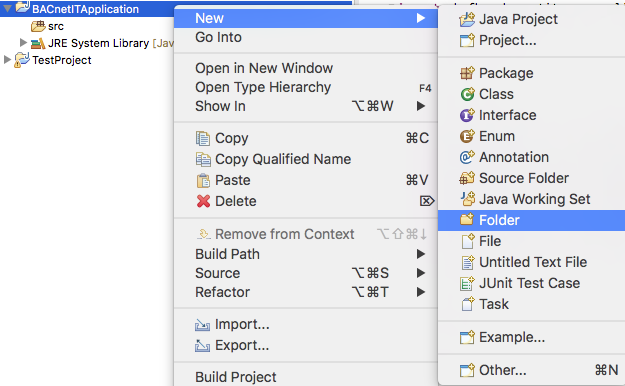
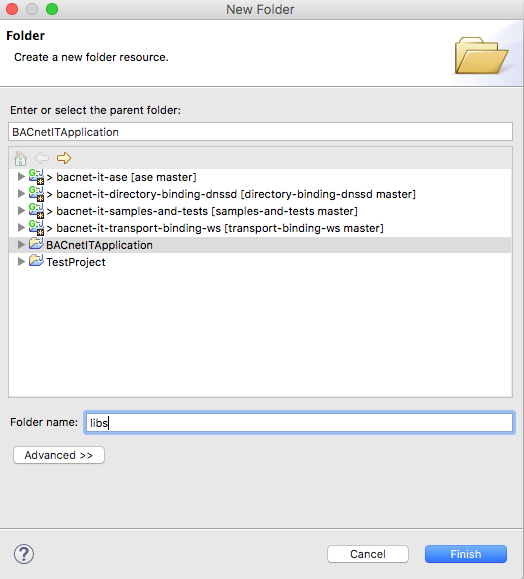
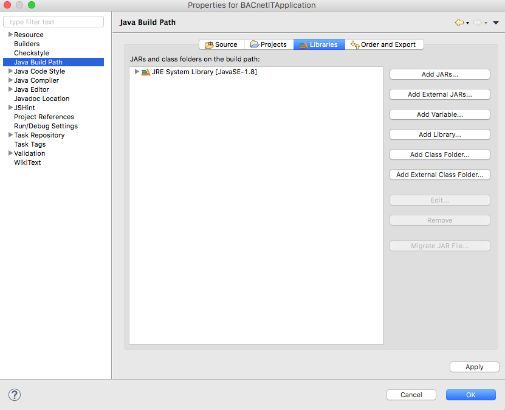
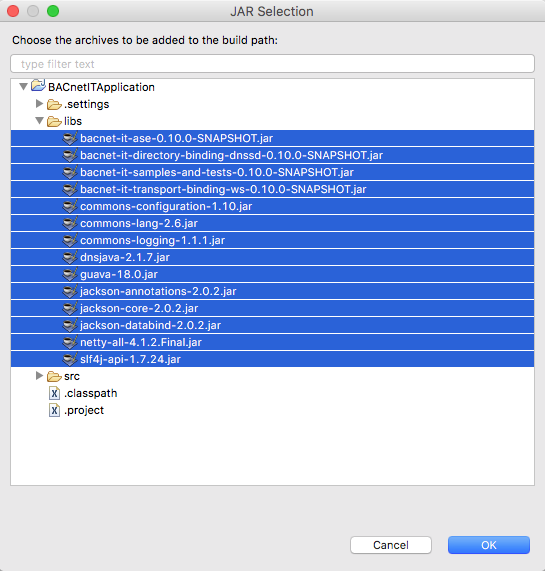

## Download
[Go back to start page](../../README.md)

Download the binary distribution from [here](https://www.cs.technik.fhnw.ch/bacnet-it/releases).  
As an alternative [build the JARs from source](../5_build/README.md) .

## Prerequisites
- [JAVA JDK 8](http://www.oracle.com/technetwork/java/javase/downloads/index.html) (this tutorial was tested with 1.8.0_102-b14)
- An Integrated Development Environment like [Eclipse](http://www.eclipse.org) or [IntelliJ](https://www.jetbrains.com/idea/)
- The BACnet/IT library binaries

### Eclipse Configuration
+ Create a new __Java Project__ in Eclipse.

+ Name the new project __BACnetITApplication__ and ensure Java 8 is selected as execution JRE.

+ Create a folder __libs__ within the project __BACnetITApplication__

+ Open the project properties

+ Copy all 14 JAR files into the the created __libs__ folder.

+ Click on __Add JARs...__ in the menu __Java Build Path / Libraries__

+ Add all the JAR files (from [Download](#download) ) by selecting them.

[Go to Create a Demo Applicaton without Directory Service](../3_demo_app_no_directory/README.md)  