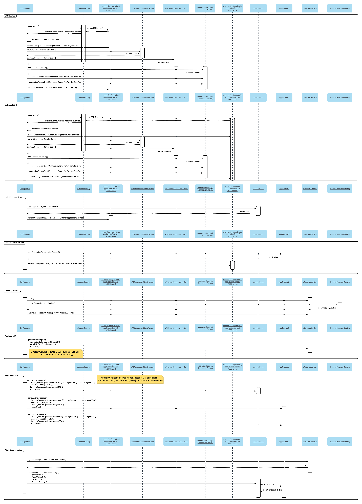

## Create a Demo Application using the Directory Service.
[Go back to start page](../../README.md)

The project __directory-binding-dnssd__ provides a DNSSD directory binding implementation.  
Instead of using the DNSSD binding, we will implement a __DummyDirectoryBinding__ in this example.  
The __ch.fhnw.bacnetit.ase.network.directory.api.DirectoryService__ class is the directory access used by application and bacnet devices.  
All directory bindings have to implement the __ch.fhnw.bacnetit.ase.network.directory.api.DirectoryBinding__ interface.


- Create a java class called __DummyDirectoryBinding.java__ that implements DirectoryBinding.

```java
import java.net.URI;
import java.util.LinkedList;
import java.util.List;
import java.util.Map;
import java.util.Map.Entry;
import java.util.concurrent.ConcurrentHashMap;
import ch.fhnw.bacnetit.ase.encoding.api.BACnetEID;
import ch.fhnw.bacnetit.ase.network.directory.api.DirectoryBinding;

// All directory bindings have to implement the DirectoryBinding interface
public class DummyDirectoryBinding implements DirectoryBinding {
    
    // BACnetEID of bds
    private volatile BACnetEID bds = null;
    // Records
    private volatile Map<BACnetEID, URI> records = new ConcurrentHashMap<BACnetEID,URI>();
    
    public DummyDirectoryBinding(){
        
        // Thread to print the current state of records.
        new Thread(new Runnable(){
            @Override
            public void run() {
                
                while(true){
                    StringBuffer sb = new StringBuffer();
                    for (Entry<BACnetEID, URI> entry : records.entrySet()) {
                        sb.append(entry.getKey().getIdentifierAsString()+"->"+entry.getValue()+"\n****\n");
                    }
                    System.out.println("DirectoryBinding:\nBDS:" + ((bds!=null) ? bds.getIdentifierAsString():"not set")+"\n"+sb.toString());
                    try {
                        Thread.sleep(3000);
                    } catch (InterruptedException e) {
                        // TODO Auto-generated catch block
                        e.printStackTrace();
                    }
                }
            }
        }).start();
    }

    @Override
    public void delete(BACnetEID arg0) {
        // TODO Auto-generated method stub
        
    }

    @Override
    public List<BACnetEID> findBDS() {
        if (this.bds != null ){
            List<BACnetEID> bdss = new LinkedList<BACnetEID>();
            bdss.add(bds);
            return bdss;
        }
        return null;
    }

    @Override
    public void register(BACnetEID bacnetEID, URI uri, boolean isBds) {
        if (bacnetEID == null)
                return;
        if (isBds && this.bds == null){
            this.bds = bacnetEID;
            System.out.println("BDS set");
        }
        // Overwrite existing values
        records.put(bacnetEID, uri);
       
        
    }

    @Override
    public void registerObject(String arg0, boolean arg1, String arg2,
            BACnetEID arg3, String arg4, int arg5, int arg6) {
        // TODO Auto-generated method stub
        
    }

    @Override
    public URI resolve(BACnetEID bacnetEID) {
        return this.records.get(bacnetEID);
    }
}
```
- Extend the method __onIndication(T_UnitDataIndication tUnitDataIndication, Object context)__ of bacnet device 1001 in class __Application1.java__ with a further __else if__ case.  
That case will handle incoming AddListElementRequests. (Contains information about the bacnet device that should be registered)

```java
// Device 1001 of application 1 is BDS. Therefore it has to handle remote directory register requests
else if (incoming instanceof ConfirmedRequest && ((ConfirmedRequest)incoming).getServiceRequest() instanceof AddListElementRequest){
	SequenceOf<?> charcterStrings = ((AddListElementRequest)((ConfirmedRequest)incoming).getServiceRequest()).getListOfElements();
	System.out.println("BDS got an AddListElementRequest");
	for (Encodable cs : charcterStrings ) {
		try {
			DirectoryService.getInstance().register(tUnitDataIndication.getData().getSourceEID(), new URI(cs.toString()), false, false);
		} catch (URISyntaxException e) {
			// TODO Auto-generated catch block
			e.printStackTrace();
		}
	}
}
```

- Adjust class __Configurator__
	- Let device 1001 be the BDS. The BDS registers itself directly using __DirectoryService__. All other devices send AddListElementRequest towards the BDS to register themselves. 
	
	```java
	DirectoryService.init();
   DirectoryService.getInstance().setDNSBinding(new DummyDirectoryBinding());

    // Register device 1001 as BDS
   DirectoryService.getInstance().register(
   		application1.devices.get(0).getEID(),
		new URI("ws://localhost:8080"), true, false);
	``` 
	- Let devices 1002, 2001 and 2002 register themselves by sending AddListElementRequests to the BDS.
	
	```java
	 		// Register 1002 using BDS
            ByteQueue bq = new ByteQueue(
                    performRegisterOverBds(
                    	application1.devices.get(1).getEID(),
                     	new URI("ws://localhost:8080"),
                      	application1.devices.get(0).getEID()));

            application1.sendBACnetMessage(
                    DirectoryService.getInstance()
                            .resolve(DirectoryService.getInstance().getBds()),
                    application1.devices.get(1).getEID(),
                    application1.devices.get(0).getEID(), bq.popAll());

            // Register 2001 using BDS
            bq = new ByteQueue(
                    performRegisterOverBds(application2.devices.get(0).getEID(),
                            new URI("ws://localhost:9090"),
                            application1.devices.get(0).getEID()));

            application2.sendBACnetMessage(
                    DirectoryService.getInstance()
                            .resolve(DirectoryService.getInstance().getBds()),
                    application2.devices.get(0).getEID(),
                    application1.devices.get(0).getEID(), bq.popAll());

            // Register 2002 using BDS
            bq = new ByteQueue(
                    performRegisterOverBds(application2.devices.get(1).getEID(),
                      	new URI("ws://localhost:9090"),
                       application1.devices.get(0).getEID()));

            application2.sendBACnetMessage(
                    DirectoryService.getInstance()
                            .resolve(DirectoryService.getInstance().getBds()),
                    application2.devices.get(1).getEID(),
                    application1.devices.get(0).getEID(), bq.popAll());
   
   // Additional method to build a AddListElementRequest. Consider the BACnet/IT spec for the detailed and correct structure.
   public static byte[] performRegisterOverBds(BACnetEID who, URI location,BACnetEID bds) {
        final SequenceOf<CharacterString> uriChars = new SequenceOf<CharacterString>();
        uriChars.add(new CharacterString(location.toString()));
        final AddListElementRequest request = new AddListElementRequest(
                new BACnetObjectIdentifier(BACnetObjectType.multiStateInput, 1),
                BACnetPropertyIdentifier.stateText, null, uriChars);
        final ByteQueue byteQueue = new ByteQueue();
        request.write(byteQueue);
        return byteQueue.popAll();

   ```
   
	- Replace the fix destination URIs by a __DirectoryService.getInstance().resolve()__ invoke.
   
	```java
	application1.sendReadPropertyRequestUsingBACnet4j(
	        DirectoryService.getInstance().resolve(new BACnetEID(2001)),
	        new BACnetEID(1001), new BACnetEID(2001));
	
	//...
	
	application2.sendBACnetMessage(
	        DirectoryService.getInstance().resolve(new BACnetEID(1001)),
	        new BACnetEID(2001), new BACnetEID(1001), whoIsRequest);
	          
	```
	
	Note the detailed sequence diagram about the tasks of the __Configurator__ in a setup with Directory Service: [Picture](../images/configuratorTasksDetail.png)
	
	
	
[Go to Build from source](../build/README.md)  